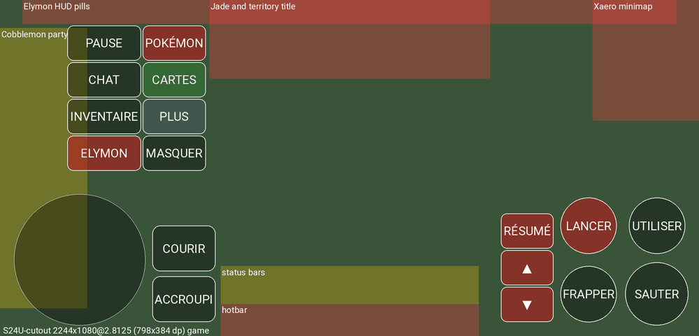
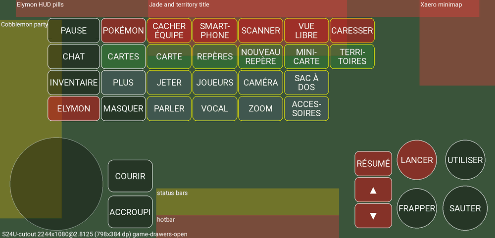
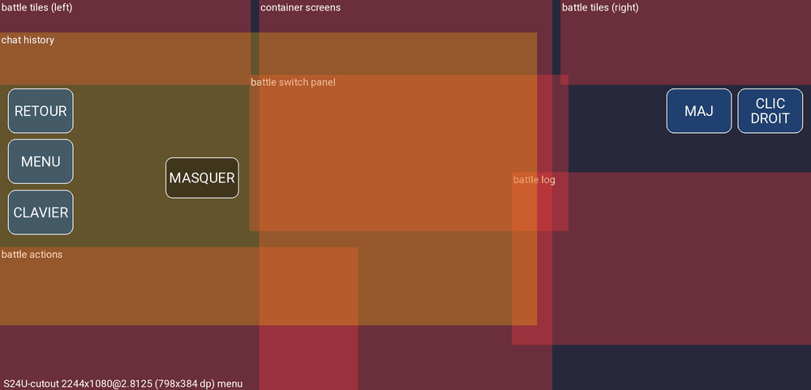
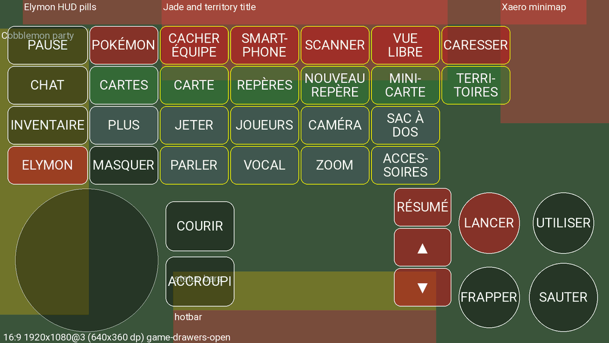

# Elymon touch controls

Elymon ships its own default layout for Amethyst's custom controls (schema version 8), with
Cobblemon keys and room for the Elymon HUD.

- `elymon-default.json` in this folder is a byte-for-byte copy of
  `app_pojavlauncher/src/main/assets/default.json`, kept here for review.
- Both are generated by `tools/elymon/controls/make_layout.py`. Edit that script, never the JSON.
- `tools/elymon/test-controls.sh` runs every host check (see [Checks](#checks)).

## Button map

The previews come from `tools/elymon/check-controls.py --preview DIR`. Red areas must stay free. Yellow areas may be covered.

### In game

| Button | Key | Action (Android binding) |
|---|---|---|
| joystick | W A S D, Left Ctrl | move; pushing it to the top locks forward and sprints (`forwardLock`) |
| **Courir** | Left Ctrl | sprint (tap; sprinting goes on while moving forward) |
| **Accroupi** | Left Shift | sneak. A plain button: the seeded `toggleCrouch:true` makes each tap switch crouching on or off |
| **Sauter** | Space | jump |
| **Frapper** | left click (−3), pass-through | attack or mine while held; the finger can also aim |
| **Utiliser** | right click (−4), pass-through | use or place, interact with a Pokémon, throw a Poké Ball |
| **Lancer** | R | Cobblemon: send out or recall the selected Pokémon, challenge, reopen a minimised battle |
| **▲ / ▼** | ↑ / ↓ | Cobblemon: select the previous or next party slot |
| **Résumé** | M | Cobblemon: party summary |
| **Pause** | Esc | pause menu. Amethyst's menu is then under **Menu** |
| **Chat** | T | chat. **Clavier** then shows in the chat screen |
| **Inventaire** | E | inventory |
| **Elymon** | J | Elymon menu |
| **Masquer** | −2 | hides or shows all the controls. Shown in screens too, never hidden itself |
| **Pokémon ▸** | drawer | Cacher équipe (O), Smartphone (K), Scanner (X, smartphone scanner), Vue libre (Left Alt, toggle: riding free look), Caresser (G, Pet your Cobblemon) |
| **Cartes ▸** | drawer | Carte (N, Xaero world map), Repères (U), Nouveau repère (F6), Mini-carte (Z, enlarge the minimap), Territoires (`, FTB Chunks claims map) |
| **Plus ▸** | drawer, two rows | Jeter (Q), Joueurs (Tab, held), Caméra (F5), Sac à dos (B), Parler (mouse button 5, held: voice chat push-to-talk), Vocal (V, voice chat menu), Zoom (C, held: Elythera zoom), Accessoires (H) |

The drawers open to the right, one lane each.

Gestures work as in upstream Amethyst:
- **In the game view:** a tap uses (right click), and a long press attacks (left click).
- **On the hotbar:** a tap selects a slot, a double tap swaps hands (F), and holding drops the item (Q).

### In screens (inventory, chat, battle, menus)

| Button | Key | Action |
|---|---|---|
| **Retour** | Esc | closes the screen; in a battle, minimises it (**Lancer** reopens it) |
| **Menu** | −9 | Amethyst's menu (custom controls, logs…). Because the layout has a menu button, the pull tab is hidden |
| **Clavier** | −1 | Android keyboard |
| **Maj** | Left Shift, held | shift-click |
| **Clic droit** | right click, held | split a stack; in EMI, show uses |
| **Masquer** | −2 | see above |

Letter keys never show in screens. The Android keyboard sends real characters, so a visible **Lancer** would type an "r" into EMI's search box.

## What the layout keeps free

Positions are exp4j expressions. Some are measured in Minecraft GUI pixels, which follow the game's automatic GUI scale. The expressions use the scale's upper bound, `min(W/320, H/240)` physical pixels.

**In game:**
- Elymon HUD pills: `HudPillsLayer`, top 16 GUI px, 16 px side margins.
- Jade's tooltip and the territory title, in the middle band under the pills.
- Xaero's minimap in the top-right corner.
- The hotbar's touch strip.

**In screens:**
- Cobblemon's battle tiles.
- The action and move buttons.
- The message log.
- The switch panel.
- A 176-px container in the middle.

**Allowed overlaps:**
- Cobblemon's party column on the left. The joystick and part of the upper-left buttons cover it on phones; **Cacher équipe** hides it.
- The hearts and food bars.
- Open drawers cross the middle band, and on 640-dp-wide screens they reach the minimap's edge.
- In the chat screen, the left-hand buttons cover the start of the older lines. The newest lines, at the bottom, stay clear.

**How the upper-left group is placed:**
- It ends where the middle band starts, and moves over the party column only as far as needed.
- If even that does not fit (tablets, very large GUI scale), it goes under the band.

**Near the hotbar:**
- Bottom groups that would reach it (Courir/Accroupi, and ▲▼Résumé on 16:9 screens) rise above it.

## Key bindings on Android

On NeoForge, a key fires every binding it is bound to. With the pack's defaults, M alone opens Cobblemon's summary, opens the FTB Chunks map and mutes voice chat. The layout needs each key it sends to drive exactly one action in game.

**Where the fix lives:**
- The fix is Android-only: the `colonKeySet` overlay of `config/defaultoptions/keybindings.txt` in `assets/elymon/android-policy.json`.
- The pack's shared file is never edited.
- The sync engine applies the overlay after download and remembers the result, so the file is not downloaded again.

**Keys the overlay moves off conflicts:**

| Binding | Before (pack or mod default) | Android |
|---|---|---|
| hotbar save / load activators (vanilla) | C / X | unbound |
| Xaero new waypoint | B | F6 |
| smartphone scanner | C | X |
| FTB Chunks map | M | ` |
| voice chat mute / disable / hide icons / group | M / N / H / G | unbound |
| voice chat push-to-talk | unbound | mouse button 5 (Amethyst −11) |
| PokeBike headlight | O | F7 |
| backpack inventory interaction | C | unbound |
| backpack upgrade toggles 1 / 2 | Alt+Z / Alt+X | unbound (**Vue libre** holds Alt) |
| Just Zoom | Z | unbound (Elythera's zoom on C stays) |

**Keys it restates:** every other key the layout, joystick or hotbar sends, so that a later change to the shared file cannot move a key away from its button.

**Keys shared on purpose:**
- Space: jump and skip the respawn cinematic.
- Left Shift: sneak and Jade's details. Carry On's key is conflict-free.

### Why the overlay alone is not enough

DefaultOptions 21.1.8 reads `keybindings.txt` at every start and makes its keys the new defaults. It moves a binding only when both of these hold:
- `options.txt` has no `key_` line for it. `collectSeenKeys` marks every such line "seen".
- The binding is still on its mod default (`KeyMappingDefaultsHandler.loadDefaults`).

Minecraft writes a `key_` line for every binding the first time it saves `options.txt`. So:

- **Fresh install:** the sync seeds `options.txt` without any `key_` line. DefaultOptions then applies the Android keys at the first start.
- **An install that has already played,** such as the wave-1 builds or a later layout that changes a key: DefaultOptions skips every binding. `com.elythera.elymon.controls.KeybindingMigration` handles these installs:
  - It runs at app start, not while the game runs.
  - A `key_` line whose value is one the binding had by default before is set to the Android value. Those earlier values are listed in `assets/elymon/controls-keybindings.json`: the pack's file, the mod default, and earlier Android values.
  - A value the player chose stays.
  - It runs once per version of the two files, so it never fights a player who later picks an old value on purpose.

**When you change an overlay value,** add the old value to `controls-keybindings.json`. `check-controls.py` fails when the two files disagree.

## Installing and updating the layout

At every app start, `AsyncAssetManager.unpackSingleFiles` calls `ElymonControls.onAppStart`. It replaces upstream's step, which wrote `new_default.json` and never replaced anything.

| `controlmap/default.json` | What happens |
|---|---|
| missing (first run) | the shipped layout is written; Amethyst loads `default.json` when no other default was chosen |
| already the shipped layout | nothing |
| a layout an Elymon build installed and nobody edited (SHA-256 recorded at install, or listed in `ElymonControls.LAYOUTS`, which includes upstream Amethyst's layout from the first builds) | replaced |
| edited by the player | kept; the shipped layout is saved beside it as `elymon-<version>.json`, and the player is told once, in French, when controls next show |

An upstream `new_default.json` holding one of our layouts is deleted.

## Changing the layout

1. Edit `tools/elymon/controls/make_layout.py`, then run it.
2. Add an entry `{"<next version>", "<sha256>"}` at the end of `ElymonControls.LAYOUTS`. Never edit an old entry: older installs are recognised by those hashes. `check-controls.py` prints the SHA-256.
3. If keys change, update the overlay in `android-policy.json`, the history in `controls-keybindings.json`, and `EXPECTED` in `check-controls.py`.
4. Run `bash tools/elymon/test-controls.sh` and `bash tools/elymon/test-sync.sh`.

## Checks

`tools/elymon/test-controls.sh` runs three checks. The first is `make_layout.py --check`.

The second is `check-controls.py`, which checks:
- **Schema:** the JSON against the fields Gson maps, read from the Java sources.
- **Key codes:** against `LwjglGlfwKeycode` and `SPECIALBTN_*`.
- **Positions:**
  - Screens: 13 of them (2340×1080 at three densities, 2244×1080 for the S24 Ultra with its cutout, 1600×720, 2400×1080, 1920×1080, 2048×1536, 2560×1600).
  - What it checks: overlaps and zones.
  - Button sizes: 100 % must pass. 80 % passes. 120 % is reported and overlaps on phones.
- **Letter keys:** none shown in screens.
- **Key bindings:** each key drives its expected action, with the overlay applied to the pack's `keybindings.txt`, whose snapshot is in `tools/elymon/controls/pack-keybindings.txt`.
- **Hashes:** the SHA-256 history.
- **Labels:** measured with Roboto (a warning).

The third is `ControlsHostTests` (Java 8, no Android):
- layout install and upgrade;
- migration of `options.txt` against the real assets;
- every position recomputed with the real exp4j jar and compared with the checker.

## Limits and things to check on a device

- **Button size 120 %:** overlaps on phones. Players at that size need the editor.
- **Labels** are sized for Roboto. OEM fonts may be a bit wider.
- **▲ ▼** come from Android's symbol fallback font.
- **Push-to-talk (mouse button 5)** needs the microphone permission. It is inferred that Simple Voice Chat reads a mouse push-to-talk key through Amethyst's GLFW.
- **Vue libre** is a toggle. Turn it off before closing the Pokémon drawer, or Alt stays held.
- **Plus** is a FREE drawer. Moving it in the editor does not move its sub-buttons.
